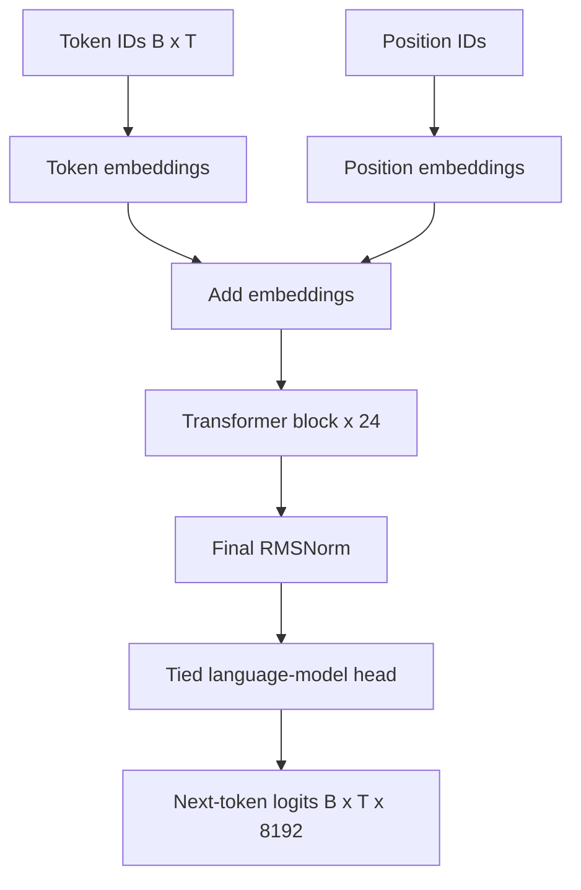

# Codexa v1 Base Architecture

The active configuration is `configs/1b.yaml`.

| Layers | Hidden | Heads | SwiGLU width | Context | Vocabulary | Parameters |
| ---: | ---: | ---: | ---: | ---: | ---: | ---: |
| 24 | 1,536 | 24 | 6,144 | 2,048 | 8,192 | 921,773,568 |

The model is a pre-normalized decoder-only Transformer with RMSNorm, causal
scaled-dot-product attention, SwiGLU feed-forward layers, learned position
embeddings, and tied token/output embeddings.

Each Transformer block applies pre-normalized causal self-attention followed by
a residual connection, then pre-normalized SwiGLU followed by a second residual
connection. Training uses shifted next-token labels and cross-entropy loss.

The configured 1B-class model requires gradient checkpointing and an 8-bit
AdamW optimizer for the intended 16 GB GPU. A real short-run memory and
throughput test remains mandatory before long training.
