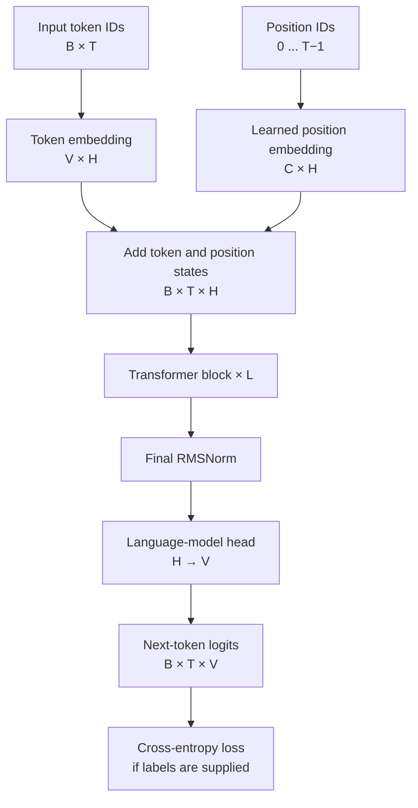
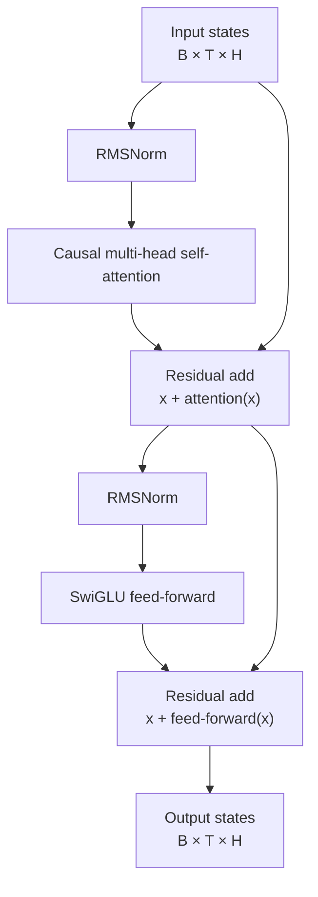
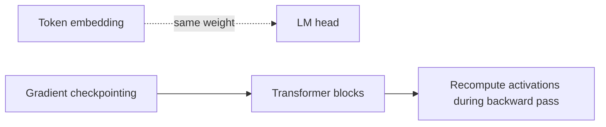

# Codexa v1 Architecture

## Configuration tiers

| Tier | Layers | Hidden | Heads | SwiGLU width | Context | Parameters |
| --- | ---: | ---: | ---: | ---: | ---: | ---: |
| Smoke | 8 | 384 | 6 | 1,024 | 256 | 17,406,336 |
| Prototype | 16 | 512 | 8 | 1,365 | 1,024 | 55,058,944 |
| 250M | 34 | 768 | 12 | 2,048 | 2,048 | 248,565,504 |

All tiers use a decoder-only, pre-normalized Transformer with RMSNorm,
SwiGLU feed-forward layers, causal scaled-dot-product attention, learned
position embeddings, and tied token/input-output embeddings.

## Model data flow



Where `B` is batch size, `T` is sequence length, `V` is vocabulary size,
`H` is hidden size, `C` is context length, and `L` is the number of blocks.

The model accepts integer token IDs, adds a learned embedding for each token
to its learned position embedding, and passes the resulting sequence through
the same Transformer block repeatedly. The output head produces one
vocabulary-sized logit vector for every input position. During generation,
the causal attention mask prevents a position from reading future tokens.

## Transformer block



Attention uses one bias-free projection to produce queries, keys, and values,
splits them into heads, applies causal scaled dot-product attention, merges
the heads, and applies a bias-free output projection.

The SwiGLU path is:

```text
down_projection(SiLU(gate_projection(x)) × up_projection(x))
```

Both sublayers are pre-normalized and use residual connections.

## Parameter sharing and training details



When `tie_embeddings` is enabled, the output head reuses the token embedding
matrix, so it is counted only once. Gradient checkpointing is optional and
recomputes block activations during training to reduce memory use.

## 250M parameter calculation

The final architecture uses an 8,192-token vocabulary, 2,048 learned
positions, hidden width 768, 34 blocks, 12 attention heads, and a SwiGLU
intermediate width of 2,048.

- Tied token embeddings: `8,192 × 768 = 6,291,456`
- Position embeddings: `2,048 × 768 = 1,572,864`
- Attention per block: `4 × 768² = 2,359,296`
- SwiGLU per block: `3 × 768 × 2,048 = 4,718,592`
- Two RMSNorm weights per block: `2 × 768 = 1,536`
- 34 blocks: `34 × 7,079,424 = 240,700,416`
- Final RMSNorm: `768`

Total: **248,565,504 trainable parameters**.

## Memory estimate

With the current autocast implementation, parameters and gradients remain
FP32 while matrix operations use BF16. Parameters, gradients, and two FP32
AdamW moment buffers require about 3.98 GB before allocator overhead.
Activations depend on sequence length and kernel selection. PyTorch
scaled-dot-product attention avoids constructing a Python-level causal mask,
but the final stable batch size must be established by the Phase 13 benchmark
on the RTX 4080.

The measured 250M training choice is micro-batch size 2 with gradient
accumulation 16 at context length 2,048. This preserves 65,536 target tokens
per optimizer update and peaked at 7,612,661,760 reserved CUDA bytes in the
Phase 13 AdamW benchmark.
